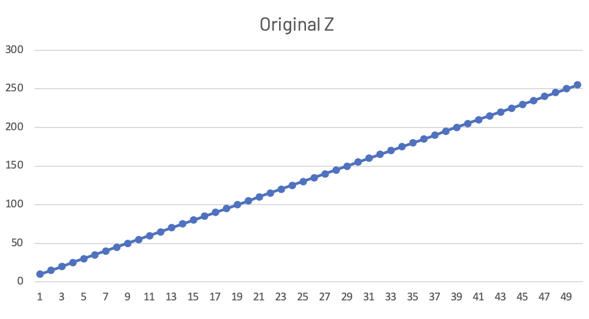
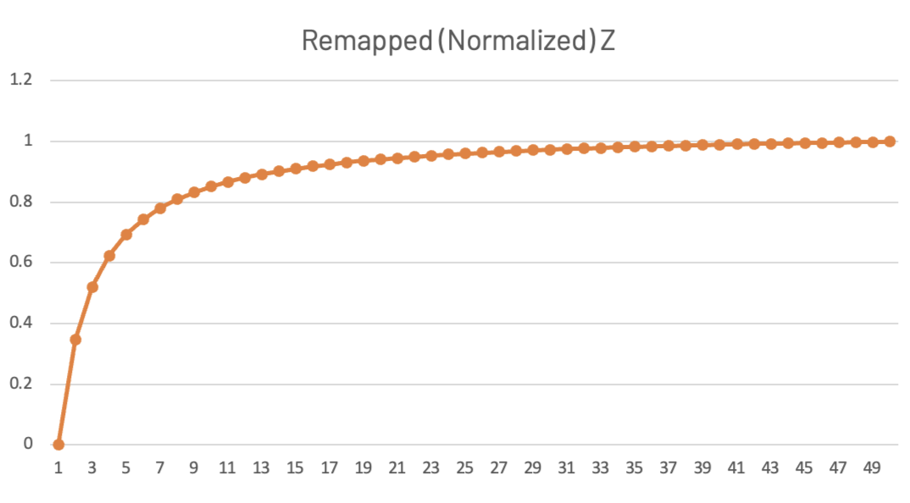

# A demonstration that the z remapping from the perspective projection is not linear

This is a simple script to demonstrate how the normalization of depth values of the perspective projection is hyperbolic (not linear).

